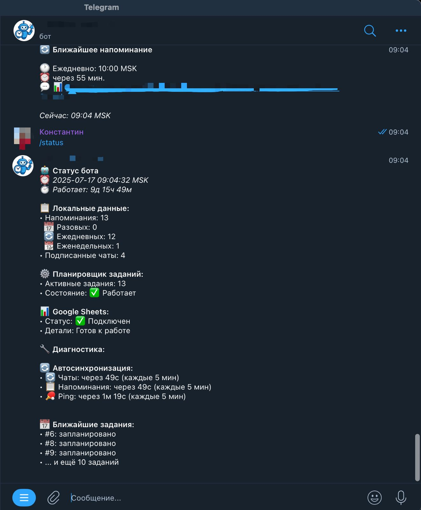
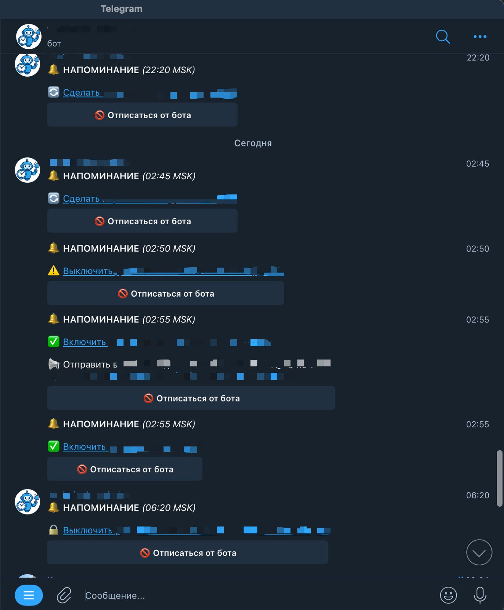
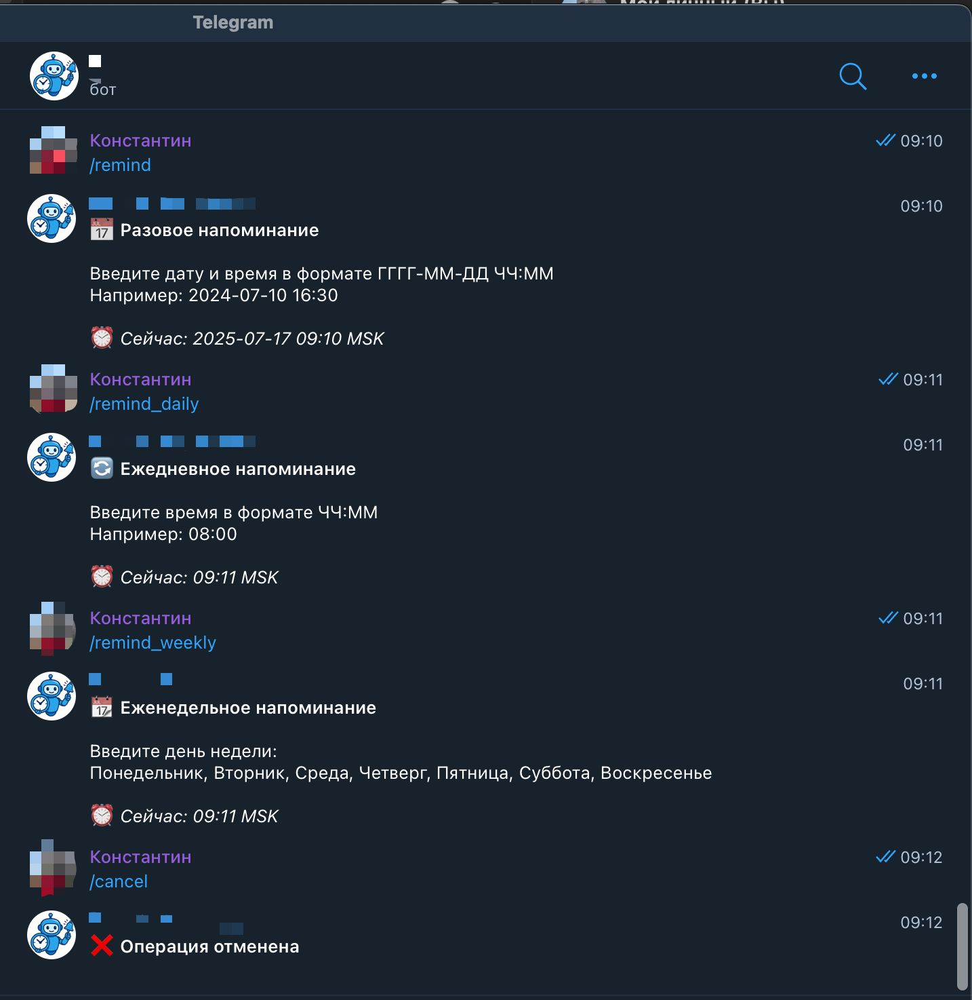

# 🤖 Telegram Reminder Bot 2.0

Telegram-бот для создания напоминаний с **автоматическим восстановлением** и **Google Sheets интеграцией**. Поддерживает разовые, ежедневные и еженедельные напоминания с автоматической синхронизацией данных.

## 📱 Демонстрация работы

<div align="center">

### 🎯 Интерфейс бота


### ⏰ Создание напоминаний  


### 📊 Google Sheets интеграция


</div>

---

## ✨ Основные возможности

### 🔔 Типы напоминаний:
- **Разовые** (`/remind`) - в конкретную дату и время
- **Ежедневные** (`/remind_daily`) - каждый день в указанное время  
- **Еженедельные** (`/remind_weekly`) - в определенный день недели

### 📊 Google Sheets интеграция:
- **Автоматическое логирование** всех операций
- **Синхронизация напоминаний** в реальном времени
- **Статистика чатов** с отслеживанием активности
- **История отправки** с детализацией ошибок
- **Резервное копирование** всех данных

### 🛡️ Система автовосстановления:
- **Автопроверка** подписок при запуске бота
- **Экстренное восстановление** при повреждении файлов
- **Почасовая синхронизация** с Google Sheets
- **Ручное восстановление** командой `/restore_reminders`
- **Защита от потери данных** при перезапусках сервера

### 🔄 Восстановление данных:
- **Восстановление напоминаний** только со статусом `Active`
- **Восстановление подписанных чатов** из Google Sheets
- **Автоматическое перепланирование** всех напоминаний
- **Полная синхронизация** одной командой

## 📁 Структура проекта

```
Reminder_now_bot_2.0/
├── 📄 bot.py                      # Основной файл бота с логикой напоминаний
├── 📄 sheets_integration.py       # Google Sheets интеграция и автовосстановление
├── 📄 requirements.txt           # Python зависимости
├── 📄 Dockerfile                 # Docker конфигурация для деплоя
├── 📄 README.md                  # Основная документация проекта
├── 📄 .gitignore                 # Исключения для Git
├── 📂 docs/                      # Техническая документация
│   ├── GOOGLE_SHEETS_SETUP.md    # Настройка Google Sheets
│   ├── RENDER_FIX.md            # Решения проблем деплоя
│   ├── FIXES_SUMMARY.md         # История исправлений
│   └── AUTO_RECOVERY_SUMMARY.md # Система автовосстановления
├── 📄 reminders.json             # 🔄 Локальные напоминания (генерируется автоматически)
├── 📄 subscribed_chats.json      # 🔄 Подписанные чаты (генерируется автоматически)
└── 📄 service-account.json       # 🔐 Google Service Account (не в репозитории)
```

> **📝 Примечание:** Файлы помеченные 🔄 генерируются автоматически при работе бота и не входят в репозиторий.

## 🚀 Быстрый старт

### 1. Клонирование репозитория
```bash
git clone https://github.com/WarSaler/telegram-repeat-bot.git
cd telegram-repeat-bot
```

### 2. Установка зависимостей
```bash
pip install -r requirements.txt
```

### 3. Настройка переменных окружения
```bash
export BOT_TOKEN="ваш_telegram_bot_token"
export GOOGLE_SHEETS_ID="id_вашей_google_таблицы" 
export GOOGLE_SHEETS_CREDENTIALS="содержимое_json_файла_service_account"
```

### 4. Запуск бота
```bash
python bot.py
```

## 📋 Команды бота

| Команда | Описание |
|---------|----------|
| `/start` | Активация бота в чате |
| `/test` | Проверка работы бота |
| `/remind` | Создать разовое напоминание |
| `/remind_daily` | Создать ежедневное напоминание |
| `/remind_weekly` | Создать еженедельное напоминание |
| `/list_reminders` | Просмотр всех активных напоминаний |
| `/del_reminder` | Удаление напоминания по ID |
| `/clear_reminders` | Удаление всех напоминаний |
| `/restore_reminders` | 🆕 **Восстановить напоминания и чаты из Google Sheets** |
| `/next` | Показать ближайшее напоминание |
| `/status` | 🆕 **Диагностика состояния бота и активных заданий** |
| `/cancel` | Отменить текущую операцию |

## 🔄 Восстановление данных после переустановки

### Команда `/restore_reminders`
**Полное восстановление данных одной командой:**

#### 📋 Что восстанавливается:
- ✅ **Все активные напоминания** (только со статусом `Active`)
- ✅ **Все подписанные чаты** из листа `Chat_Stats`
- ✅ **Автоматическое перепланирование** всех напоминаний

#### 🎯 Процесс восстановления:
```
/restore_reminders
↓
🔄 Восстановление данных...
📱 Восстановление подписанных чатов...
📋 Восстановление напоминаний...
↓
✅ Восстановление завершено успешно!

📋 Восстановлено напоминаний: 15
📅 Разовых: 5
🔄 Ежедневных: 7  
📆 Еженедельных: 3

📱 Подписанные чаты:
✅ Восстановлено чатов: 8

⏰ Все напоминания перепланированы и активны!
```

#### 🛡️ Безопасность восстановления:
- Восстанавливаются **только** напоминания со статусом `Active`
- Напоминания со статусами `Deleted`, `Disabled` и другими **игнорируются**
- Полная валидация данных перед восстановлением
- Детальное логирование всех операций

## 🔧 Google Sheets интеграция

### Структура данных:

**📋 Reminders** - все напоминания:
- ID, Text, Time_MSK, Type, Chat_ID, Chat_Name, **Status**, Created_At, Username, Last_Sent, Days_Of_Week

**📤 Send_History** - история отправки:
- Time_UTC, Time_MSK, Reminder_ID, Chat_ID, Status, Error, Text_Preview

**📊 Chat_Stats** - статистика чатов (источник для автовосстановления):
- Chat_ID, Chat_Name, Chat_Type, Reminders_Count, Last_Activity, Members_Count, First_Seen

**🔍 Operation_Logs** - логи операций:
- Timestamp, Action, User_ID, Username, Chat_ID, Details, Reminder_ID

### Автоматические функции:
- ✅ **Синхронизация каждый час** - обновление локальных файлов из Google Sheets
- ✅ **Экстренное восстановление** - автоматическое восстановление при ошибках
- ✅ **Ручное восстановление** - команда `/restore_reminders` для полного восстановления
- ✅ **Детальное логирование** - все действия записываются в таблицу
- ✅ **Мониторинг активности** - отслеживание использования бота по чатам
- ✅ **Фильтрация по статусу** - восстановление только активных данных

## 🏗️ Деплой на Render

### Переменные окружения:
```
BOT_TOKEN=your_telegram_bot_token
GOOGLE_SHEETS_ID=your_google_sheets_id
GOOGLE_SHEETS_CREDENTIALS=your_service_account_json_content
PORT=8000
BASE_URL=https://your-app-name.onrender.com
```

### Health Check:
Бот автоматически настроен для работы на Render с:
- ✅ Health check endpoint на порту 8000
- ✅ Автоматический ping каждые 5 минут
- ✅ Защита от засыпания на Free tier

### �� Проблемы с деплоем?

Если в логах видны ошибки:
- `Google Sheets credentials or ID not found`
- `subscribed_chats.json is missing or empty`
- `Emergency restore failed, no reminders will be sent`

**📋 Смотрите подробную инструкцию:** [`docs/RENDER_SETUP.md`](docs/RENDER_SETUP.md)

### 🆘 После переустановки проекта:
1. Дождитесь запуска бота
2. Введите команду `/restore_reminders` в любом чате
3. Все данные будут восстановлены автоматически

## 🛠️ Технические особенности

### Архитектура:
- **Асинхронная обработка** с APScheduler
- **Московское время** для всех операций
- **HTML форматирование** сообщений с fallback
- **Graceful degradation** при ошибках Google Sheets

### Надежность:
- **Тройная защита данных**: локальные файлы + Google Sheets + автовосстановление
- **Автоматическое восстановление** подписок из Google Sheets
- **Fallback режимы** при недоступности внешних сервисов  
- **Детальное логирование** всех операций
- **Резервное копирование** данных в облаке

### Безопасность:
- **Service Account** аутентификация для Google Sheets
- **Переменные окружения** для конфиденциальных данных
- **Валидация входных данных** во всех функциях
- **Фильтрация по статусу** при восстановлении данных
- **Обработка ошибок** без раскрытия системной информации

## 📈 Мониторинг и аналитика

### Логи включают:
- 📊 Статистику создания/удаления напоминаний
- 📤 Успешность доставки сообщений  
- 🔄 Результаты синхронизации с Google Sheets
- 🔄 Операции восстановления данных
- ⚠️ Предупреждения и ошибки системы
- 🕐 Временные метки всех операций

### Google Sheets дашборд:
- **Активные напоминания** по чатам
- **История отправки** с аналитикой ошибок
- **Пользовательская активность** по времени
- **История восстановления** данных
- **Статус синхронизации** системы

## 🤝 Разработка

### Структура кода:
- `bot.py` - основная логика бота и команды
- `sheets_integration.py` - Google Sheets API и автовосстановление
- Модульная архитектура для легкого расширения
- Подробные комментарии на русском языке

### Добавление новых функций:
1. Создайте обработчик команды в `bot.py`